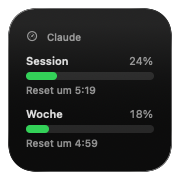
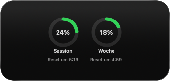
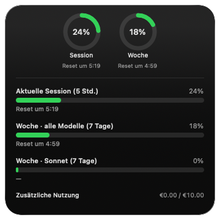
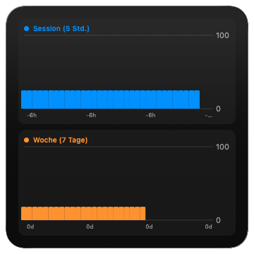

# Claude Usage — macOS menu-bar app & widget for Claude usage limits

**Claude Usage** is a tiny **macOS menu-bar app and widgets** that show your
**Claude (and Claude Code) Pro/Max usage limits** at a glance — the **session
(5-hour)** and **weekly (7-day)** windows, the same numbers as `claude /usage`
and the Claude app's *Usage* screen — with history charts, limit notifications,
and graceful rate-limit handling.

*Keywords: Claude usage monitor, Claude Code usage, Anthropic Pro/Max limits,
session & weekly rate limits, macOS menu bar app, WidgetKit widget, SwiftUI.*

[](https://github.com/Julian3521/ClaudeUsage/releases/latest)
[](https://github.com/Julian3521/ClaudeUsage/releases)
[](https://github.com/Julian3521/ClaudeUsage/actions/workflows/ci.yml)

## ⬇️ Download

### [Download **ClaudeUsage.dmg** →](https://github.com/Julian3521/ClaudeUsage/releases/latest/download/ClaudeUsage.dmg)

macOS 14+ · open the DMG and drag the app to **Applications**. It lives in the
menu bar (no Dock icon) — click the gauge, then **Sign in**. *(First launch:
right-click the app → Open.)*

#### Features

- Live **progress bar + percentage** in the menu bar (session, weekly, or both).
- A click-through panel with bars, reset countdowns, **spend (€)** and a history
  sparkline; ⚠️ marker when a fetch fails.
- **Widgets** (Small/Medium/Large) incl. a **histogram** of utilization over time.
- **Notifications** near a limit, **launch at login**, configurable refresh, and
  optional **auto-open** of new 5-hour windows.
- Localized in **English, German, French, Spanish**.

## Screenshots

| Compact | Rings | Large |
| --- | --- | --- |
|  |  |  |



> ⚠️ **Unofficial.** Reuses the public Claude Code OAuth client and an
> undocumented usage endpoint (`/api/oauth/usage`), for personal use with your own
> account. Anthropic may change or block it at any time. Not affiliated with Anthropic.

---

## Build from source (open source)

Requirements: **macOS 14+**, **Xcode 26** (Icon Composer app icon + Swift 6),
a Claude subscription, and an Apple Developer account for signing.

```bash
brew install xcodegen
xcodegen generate
open ClaudeUsage.xcodeproj
```

1. Set your **Team** in `project.yml` (`DEVELOPMENT_TEAM`) or in Xcode → Signing.
2. Run the **ClaudeUsage** scheme (menu-bar agent — look for the gauge icon).
3. Open **Settings → Account** (the gauge menu has *Sign in* / *Settings…*). The
   usage endpoint needs the `user:profile` scope, which your existing Claude Code
   login already has, so paste that token: the Account tab shows a one-line command
   that copies it to your clipboard — paste it and **Save & connect**. Signing out
   and back in also happens here.
4. Add a widget: right-click the desktop → *Edit Widgets* → search **Claude Usage**.

## How it works

```text
Login  → paste the existing Claude Code token (Keychain, has user:profile)
App    → api.anthropic.com/api/oauth/usage  (Bearer + anthropic-beta: oauth-2025-04-20)
         → five_hour / seven_day / sonnet / spend  → snapshot (Keychain) → widget reads it
```

- **`Shared/`** — models, Keychain token/snapshot/history/settings stores, usage
  API, shared SwiftUI views. Swift 6 language mode, `@Observable`.
- **`App/`** — AppKit `NSStatusItem` menu bar (live-updated via `Observation`),
  SwiftUI popover, login window, `TabView` Settings. The app is the single fetcher.
- **`Widget/`** — WidgetKit provider + views (incl. Swift Charts histograms). It
  only renders the snapshot the app writes, so it never adds endpoint load.
- **`Tests/`** — decoder unit tests against a real response (`xcodebuild test`).

## Releasing (DMG)

`scripts/release.sh` archives, signs (Developer ID), builds a DMG, and notarizes
it. In CI, pushing a `vX.Y.Z` tag runs `.github/workflows/release.yml` and attaches
the DMG to a GitHub release. Required repo secrets: `BUILD_CERTIFICATE_BASE64`
(Developer ID .p12, base64), `P12_PASSWORD`, `KEYCHAIN_PASSWORD`, `NOTARY_APPLE_ID`,
`NOTARY_TEAM_ID`, `NOTARY_PASSWORD` (app-specific password).

## If the percentages look wrong

The `/api/oauth/usage` schema is undocumented, so the decoder in
[`Shared/UsageModels.swift`](Shared/UsageModels.swift) is tolerant. Use the menu's
**⋯ → Copy raw response** and open an issue / adjust the decoding.

## License

MIT — see [LICENSE](LICENSE). Personal project, use at your own risk.
